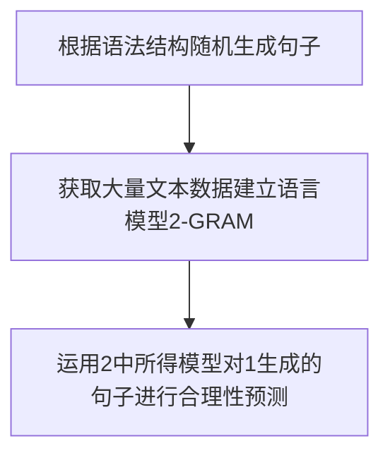

[TOC]


## 算法分析

### 1. N-Gram 语言模型

**word序列**：w1, w2, w3, … , wn

**链式规则**：

P(w1, w2, … , wn)=P(w1)P(w2|w1)P(w3|w1w2)…P(wn|w1w2…wn-1)或
P(w1, w2, … , wn)=P(w1|w2…wn-1)P(w2|w2...wn)…P(wn)

对于1-gram，其假设是P(wn|w1w2…wn-1)≈P(wn)
对于2-gram，其假设是P(wn|w1w2…wn-1)≈P(wn|wn-1)
对于3-gram，其假设是P(wn|w1w2…wn-1)≈P(wn|wn-1,wn-2)

而P(wn|wn-1) = P(wnwn-1)/P(wn-1)
实际计算中,计算wnwn-1同时出现的频率，和wn-1的频率

### 2. 搜索算法

1. 广度优先
2. 深度优先
3. 基于1.2每次都自定义队列的排列顺序，从而是实现自定搜索算法
4. 最短路径？

### 3. 梯度下降

#### 梯度下降算法的数学解释

$$
\Theta^1 = \Theta^0 - \alpha\nabla J(\Theta) \quad evaluated\quad at\quad \Theta^0  \\
\begin{align}\notag
\Theta^1 &：下一步位置  \\ \notag
\Theta^0 &：当前位置\\ \notag
\alpha&:步长\\\notag
J(\Theta) &:当前梯度
\end{align}\tag{3.1}
$$ {align}

==α是什么含义？==
 α在梯度下降算法中被称作为**学习率**或者**步长**，意味着我们可以通过α来控制每一步走的距离，以保证不要步子跨的太大扯着蛋，哈哈，其实就是不要走太快，错过了最低点。同时也要保证不要走的太慢，导致太阳下山了，还没有走到山下。所以α的选择在梯度下降法中往往是很重要的！α不能太大也不能太小，太小的话，可能导致迟迟走不到最低点，太大的话，会导致错过最低点！


#### 实例分析

###### 单变量函数的梯度下降

我们假设有一个单变量的函数：
$$
\quad\quad\ \ 函数：J(\theta) = \theta^2 \quad \\ \tag{3.2}
函数微分：J'(\theta)  = 2\theta\\
初始起点：\theta^0 = 1 \quad \ \ \ \\
学习率：\alpha =0.4 \
$$
根据公式(1)进行迭代计算：
$$
\begin{align}\notag
\theta^0 & = 1\\ \notag
\theta^1 &= \theta^0 - \alpha*J'(\theta^0)\\\notag
&=1-0.4*2\\\notag
&=0.2\\\notag
\theta^2 &= \theta^1 - \alpha*J'(\theta^1)\\\notag
&=0.2-0.4*0.4\\\notag
&=0.04\\\notag
\theta^3 &= 0.08\\\notag
\theta^4 &= 0.0016\\\notag
\end{align}\notag
$$
如图，经过四次的运算，也就是走了四步，基本就抵达了函数的最低点


###### 多变量函数的梯度下降

我们假设有一个双变量的函数：
$$
\begin{align}\tag{3.3}
\quad\quad\ \ 函数：J(\Theta) &= \theta_1^2 +\theta_2^2\quad \\\notag
函数微分：J'(\Theta)  &= 2\theta_1 \frac{\partial J(\Theta)}{\partial\theta_1} + 2\theta_2\frac{\partial J(\Theta)}{\partial\theta_2}\\ \notag
梯度：\nabla J(\Theta) &=(2\theta_1, 2\theta_2)\\\notag
初始起点：\Theta^0 &= (1,3) \quad \ \ \ \\\notag
学习率：\alpha &=0.1 \ \notag
\end{align}
$$
根据公式(1)进行迭代计算：
$$
\begin{align}\notag
\theta^0 & = (1,3)\\ \notag
\theta^1 &= \theta^0 - \alpha*\nabla J(\Theta)\\\notag
&=(1,3)-0.1*(2,6)\\\notag
&=(0.8,2.4)\\\notag
\theta^2 &= \theta^1 - \alpha*\nabla J(\Theta)\\\notag
&=(0.8,2.4)-0.1*(1.6,4.8)\\\notag
&=(0.64,1.92)\\\notag
\theta^3 &= (0.512,1.536)\\\notag
\end{align}\notag
$$
我们发现，已经基本靠近函数的最小值点


具体实例见：线性回归例子：
https://github.com/HaiBlueSea/Assignment-NLP/blob/master/lesson-02/Homework-02.ipynb

### 4. 最小二乘法

$$
\varepsilon = \sum_{i = 0} ^n (y-y_i)^2 \ 最小 \Rightarrow 真值y\tag{4.1}
$$

这是一个二次函数，对其求导，导数为0的时候取得最小值：
$$
\frac{d}{dy}\varepsilon = \frac{d}{dy}\sum{(y-y_i)^2}=2\sum(y-y_i)\\ \tag{4.2}
= 2(n*y-(y_1+y_2+\cdots+y_n)) \Rightarrow y=\frac{1}{n}\sum y_i
$$
正好是算术平均数

==推广==：
算术平均数只是最小二乘法的特例，适用范围比较狭窄。

假设某种线性关系为：f(x) = ax + b
$$
\varepsilon = \sum_{i = 0} ^n (ax_i+b-y_i)^2 \ \tag{4.3}\\
\left\{ 
\begin{array}{c}
    \frac{d}{da}\varepsilon = 2\sum(ax_i+b-y_i)x_i=0  \ \\ 
    \frac{d}{db}\varepsilon = 2\sum(ax_i+b-y_i)=0  \quad \\ 
\end{array}\\
\right.
$$
此时，ε取得最小值，上述方程组为线性方程，可以解出来

具体实现实例见：
https://github.com/HaiBlueSea/Assignment-NLP/blob/master/lesson-02/Homework-02.ipynb

### 5. 最小二乘法和梯度下降区分：

其实, 在计算量方面, 两者有很大的不同, 因而在面对给定的问题时, 可以有选择性的根据问题的性质选择两种方法中的一个.

最小二乘法实际上是根据猜测曲线，来解矩阵方程，类似待定系数，在一些情况下可能解不出来解
相比之下, 梯度下降法虽然有一些弊端, 迭代的次数可能也比较高, 但是相对来说计算量并不是特别大. 而且, 在最小二乘法这个问题上, 收敛性有保证. 故在大数据量的时候, 反而是梯度下降法 (其实应该是其他一些更好的迭代方法) 更加值得被使用.

当然, 其实梯度下降法还有别的其他用处, 比如其他找极值问题. 另外, 牛顿法也是一种不错的方法, 迭代收敛速度快于梯度下降法, 只是计算代价也比较高. 

## Lesson-01

### 课前TIPS

- 善于发现问题，找到应用场景
- AI其实发展是一步一步的，架构要学好，基础要打好，学精不贪多

### 导读

- AlphaGo
- 百万视觉图片识别 -李飞飞

### AI Paradigm

1. Rule Based(语言生成-Lesson-01)
2. Probability based(语言模型-Lesson-01)
3. Problem Solving : Search Based(搜索地图-Lesson-02)
4. Mathematical or Analytic Based(Lesson-03)
5. Machine Learning (deep learning) Based 

### Coding



### Additional

#### 任务要求

模拟机器人回答问题
==input:== 'I need iPhone'
==output:== ' Image you will get iPhone soon'

#### 思路

==1 定义一个语法结构：==
defined_patterns ={
    "I need ?X": ["Image you will get ?X soon", "Why do you need ?X ?"], 
    "My ?X told me something": ["Talk about more about your ?X", "How do you think about your ?X ?"] }

==2 用输入和defined_patterns的key进行匹配==：
获取?X等标识符对应的词，比如这里的iPhone
先获得类似[('?X', 'iPhone')] 的列表，然后生成字典  {'?X': 'iPhone'}

==3 在defined_patterns中的item元素查找是否有2中生成的字典里的元素==：
如果有，把defined_patterns中的item元素中的?X用字典中的元素替换掉;
然后输出item，至此实现了任务要求

==4 在之前完成的项目添加能匹配多个的功能==：
类似步骤2，添加来能匹配多个的功能，例如

```python
IN:pat_match_with_seg('?*P is very good and ?*X'.split(), "My dog is very good and my cat is very cute".split())

OUT:[('?P', ['My', 'dog']), ('?X', ['my', 'cat', 'is', 'very', 'cute'])]
```

#### 最终效果

input   :  'Oli I feel not so good'
output :  'What other feelings do you have ?'

input   :  小明我记得面包
output :  '除了 面包 你 还 会 想起 什么 吗 ？'

input   :  小明我很难过，因为没钱
output :  '没 钱 不 应该 让 你 这么 难过 的'

## Lesson-02

​	Previous Course:

1. Out of Vocabulary(OOV)?
   Pr(w_o) = constant < Pr(w_1) :  设置成小于一次频率

###  ==简易版的导航地图==：

1. 城市经纬度数据
2. 根据城市经纬度计算距离的函数
3. 用networkx 来绘制图

#### 任务要求：

输入：两个城市
输出：求出两个城市路径


#### 思路：

==构建图关系!!==

类似图的遍历：visited 记录访问过的
广度优先遍历：
深度优先遍历：
==改变出栈的规则从而实现不同的搜索方法==：如广度优先是最先进后出，深度优先是先进先出，如果每次都改变栈里面的元素的排序就会导致不同的搜索方法


#### 与自然语言处理关系

在自然语言处理方法很多都用到这个==搜索方法==

### ==机器学习==

以数据为驱动：

#### 波士顿房价预测问题

##### 每个特征的数据拟合处理

**基本方法1**：随机生成 kx+b 中的 k，b 然后用该函数计算与实际数据的误差，从大量的随机试验中选出误差最小的->得到拟合线

**方法2**：第一个k，b随机，然后随机一个方向然后逐步增长；如果沿着该方向误差变小，继续沿着该方向，直达达到预计值。如果误差变大，则随机选择另一个方向进行处理。  
==选对方向最关键==， 如何找对改变的方向呢？
==监督让他变化  —>监督学习==

