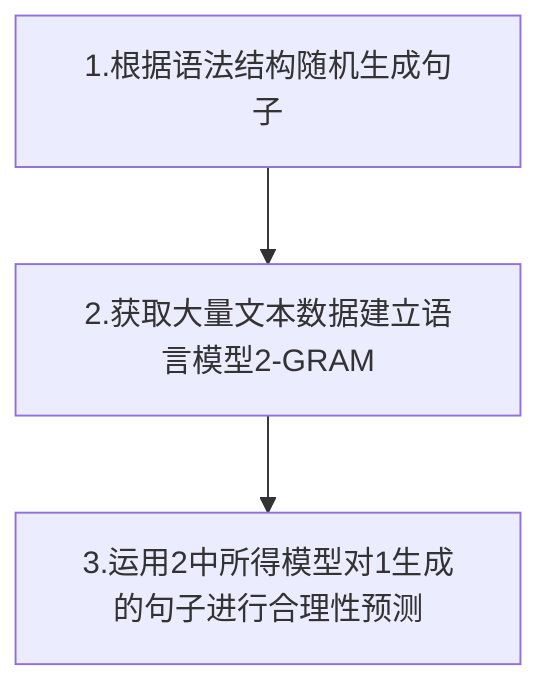

[TOC]


## 各类理论知识

### 1. N-Gram 语言模型

**word序列**：w1, w2, w3, … , wn

**链式规则**：

P(w1, w2, … , wn)=P(w1)P(w2|w1)P(w3|w1w2)…P(wn|w1w2…wn-1)或
P(w1, w2, … , wn)=P(w1|w2…wn-1)P(w2|w2...wn)…P(wn)

对于1-gram，其假设是P(wn|w1w2…wn-1)≈P(wn)
对于2-gram，其假设是P(wn|w1w2…wn-1)≈P(wn|wn-1)
对于3-gram，其假设是P(wn|w1w2…wn-1)≈P(wn|wn-1,wn-2)

而P(wn|wn-1) = P(wnwn-1)/P(wn-1)
实际计算中,计算wnwn-1同时出现的频率，和wn-1的频率

### 2. 搜索算法

1. 广度优先
2. 深度优先
3. 基于1.2每次都自定义队列的排列顺序，从而是实现自定搜索算法
4. 最短路径？

### 3. 梯度下降

#### 梯度下降算法的数学解释

$$
\Theta^1 = \Theta^0 - \alpha\nabla J(\Theta) \quad evaluated\quad at\quad \Theta^0  \\
\begin{align}\notag
\Theta^1 &：下一步位置  \\ \notag
\Theta^0 &：当前位置\\ \notag
\alpha&:步长\\\notag
J(\Theta) &:当前梯度
\end{align}\tag{3.1}
$$ {align}

==α是什么含义？==
 α在梯度下降算法中被称作为**学习率**或者**步长**，意味着我们可以通过α来控制每一步走的距离，以保证不要步子跨的太大扯着蛋，哈哈，其实就是不要走太快，错过了最低点。同时也要保证不要走的太慢，导致太阳下山了，还没有走到山下。所以α的选择在梯度下降法中往往是很重要的！α不能太大也不能太小，太小的话，可能导致迟迟走不到最低点，太大的话，会导致错过最低点！


#### 实例分析

###### 单变量函数的梯度下降

我们假设有一个单变量的函数：
$$
\quad\quad\ \ 函数：J(\theta) = \theta^2 \quad \\ \tag{3.2}
函数微分：J'(\theta)  = 2\theta\\
初始起点：\theta^0 = 1 \quad \ \ \ \\
学习率：\alpha =0.4 \
$$
根据公式(1)进行迭代计算：
$$
\begin{align}\notag
\theta^0 & = 1\\ \notag
\theta^1 &= \theta^0 - \alpha*J'(\theta^0)\\\notag
&=1-0.4*2\\\notag
&=0.2\\\notag
\theta^2 &= \theta^1 - \alpha*J'(\theta^1)\\\notag
&=0.2-0.4*0.4\\\notag
&=0.04\\\notag
\theta^3 &= 0.08\\\notag
\theta^4 &= 0.0016\\\notag
\end{align}\notag
$$
如图，经过四次的运算，也就是走了四步，基本就抵达了函数的最低点


###### 多变量函数的梯度下降

我们假设有一个双变量的函数：
$$
\begin{align}\tag{3.3}
\quad\quad\ \ 函数：J(\Theta) &= \theta_1^2 +\theta_2^2\quad \\\notag
函数微分：J'(\Theta)  &= 2\theta_1 \frac{\partial J(\Theta)}{\partial\theta_1} + 2\theta_2\frac{\partial J(\Theta)}{\partial\theta_2}\\ \notag
梯度：\nabla J(\Theta) &=(2\theta_1, 2\theta_2)\\\notag
初始起点：\Theta^0 &= (1,3) \quad \ \ \ \\\notag
学习率：\alpha &=0.1 \ \notag
\end{align}
$$
根据公式(1)进行迭代计算：
$$
\begin{align}\notag
\theta^0 & = (1,3)\\ \notag
\theta^1 &= \theta^0 - \alpha*\nabla J(\Theta)\\\notag
&=(1,3)-0.1*(2,6)\\\notag
&=(0.8,2.4)\\\notag
\theta^2 &= \theta^1 - \alpha*\nabla J(\Theta)\\\notag
&=(0.8,2.4)-0.1*(1.6,4.8)\\\notag
&=(0.64,1.92)\\\notag
\theta^3 &= (0.512,1.536)\\\notag
\end{align}\notag
$$
我们发现，已经基本靠近函数的最小值点


具体实例见：线性回归例子：
https://github.com/HaiBlueSea/Assignment-NLP/blob/master/lesson-02/Homework-02.ipynb

### 4. 最小二乘法

$$
\varepsilon = \sum_{i = 0} ^n (y-y_i)^2 \ 最小 \Rightarrow 真值y\tag{4.1}
$$

这是一个二次函数，对其求导，导数为0的时候取得最小值：
$$
\frac{d}{dy}\varepsilon = \frac{d}{dy}\sum{(y-y_i)^2}=2\sum(y-y_i)\\ \tag{4.2}
= 2(n*y-(y_1+y_2+\cdots+y_n)) \Rightarrow y=\frac{1}{n}\sum y_i
$$
正好是算术平均数

==推广==：
算术平均数只是最小二乘法的特例，适用范围比较狭窄。

假设某种线性关系为：f(x) = ax + b
$$
\varepsilon = \sum_{i = 0} ^n (ax_i+b-y_i)^2 \ \tag{4.3}\\
\left\{ 
\begin{array}{c}
    \frac{d}{da}\varepsilon = 2\sum(ax_i+b-y_i)x_i=0  \ \\ 
    \frac{d}{db}\varepsilon = 2\sum(ax_i+b-y_i)=0  \quad \\ 
\end{array}\\
\right.
$$
此时，ε取得最小值，上述方程组为线性方程，可以解出来

具体实现实例见：
https://github.com/HaiBlueSea/Assignment-NLP/blob/master/lesson-02/Homework-02.ipynb

### 5. 最小二乘法和梯度下降区分：

其实, 在计算量方面, 两者有很大的不同, 因而在面对给定的问题时, 可以有选择性的根据问题的性质选择两种方法中的一个.

最小二乘法实际上是根据猜测曲线，来解矩阵方程，类似待定系数，在一些情况下可能解不出来解
相比之下, 梯度下降法虽然有一些弊端, 迭代的次数可能也比较高, 但是相对来说计算量并不是特别大. 而且, 在最小二乘法这个问题上, 收敛性有保证. 故在大数据量的时候, 反而是梯度下降法 (其实应该是其他一些更好的迭代方法) 更加值得被使用.

当然, 其实梯度下降法还有别的其他用处, 比如其他找极值问题. 另外, 牛顿法也是一种不错的方法, 迭代收敛速度快于梯度下降法, 只是计算代价也比较高. 

## Lesson-01

### 课前TIPS

- 善于发现问题，找到应用场景
- AI其实发展是一步一步的，架构要学好，基础要打好，学精不贪多

### AI Paradigm

1. Rule Based(语言生成-Lesson-01)
2. Probability based(语言模型-Lesson-01)
3. Problem Solving : Search Based(搜索地图-Lesson-02)
4. Mathematical or Analytic Based(Lesson-03)
5. Machine Learning (deep learning) Based 

### Graph



### 1.Rule Based Model

#### 任务要求：

根据定义的语法结构随机生成句子

#### ==STEP1:==

语言的语法是有结构，我们可以根据一些定义好的结构来创建一个句子。首先我们定义以下规则：

```python
simple_grammar_frame = """
sentence => noun_phrase verb_phrase
noun_phrase => Article Adj* noun
Adj* => null | Adj Adj*
verb_phrase => verb noun_phrase
Article =>  一个 | 这个
noun =>   女人 |  篮球 | 桌子 | 小猫
verb => 看着   |  坐在 |  听着 | 看见
Adj =>  蓝色的 | 好看的 | 小小的
"""
```

#### ==STEP2==:

我们用代码把STEP1的结构解析写入到python字典中，代码如下：

```python
def Create_Grammer(gram_frame, split = '=>'):
    grammer = {}
    for line in gram_frame.split('\n'):
        if not line.strip(): continue
        exp, stmt = line.split(split)
        grammer[exp.strip()] = [word.split() for word in stmt.split('|')] #word.split()也可以去掉空格
    return grammer
```

#### ==STEP3==:

把STEP1的结构simple_grammar_frame传入STEP2中定义的函数，我们得到如下语法的字典

```python
{'sentence': [['noun_phrase', 'verb_phrase']],
 'noun_phrase': [['Article', 'Adj*', 'noun']],
 'Adj*': [['null'], ['Adj', 'Adj*']],
 'verb_phrase': [['verb', 'noun_phrase']],
 'Article': [['一个'], ['这个']],
 'noun': [['女人'], ['篮球'], ['桌子'], ['小猫']],
 'verb': [['看着'], ['坐在'], ['听着'], ['看见']],
 'Adj': [['蓝色的'], ['好看的'], ['小小的']]}
```

#### ==STEP4==:

根据STEP3得到的语法结构字典，我们随机生成句子，代码如下：
target参数：表示我们要生成语法结构的哪一项，默认是sentence

```python
def Create_Sentence(gram, target = 'sentence'):
    if target not in gram: return target
    
    expanded = random.choice(gram[target])
    return ''.join(Create_Sentence(gram, target=r) for r in expanded if r!='null')
```

#### ==STEP5==：

我们现在可以运用以上函数随机生成句子啦，而且STEP1中的语法结构可以根据自己要求来定义例如：

```python
#在西部世界里，一个”人类“的语言可以定义为：
human = """
human = 自己 寻找 活动
自己 = 我 | 俺 | 我们 
寻找 = 找找 | 想找点 
活动 = 乐子 | 玩的
"""

#一个“接待员”的语言可以定义为
host = """
host = 寒暄 报数 询问 业务相关 结尾 
报数 = 我是 数字 号 ,
数字 = 单个数字 | 数字 单个数字 
单个数字 = 1 | 2 | 3 | 4 | 5 | 6 | 7 | 8 | 9 
寒暄 = 称谓 打招呼 | 打招呼
称谓 = 人称 ,
人称 = 先生 | 女士 | 小朋友
打招呼 = 你好 | 您好 
询问 = 请问你要 | 您需要
业务相关 = 玩玩 具体业务
玩玩 = null
具体业务 = 喝酒 | 打牌 | 打猎 | 赌博
结尾 = 吗？
"""
```

#### ==STEP6==:

假设我们运用以上学习的内容来随机生成来一些句子，如下：

```python
['一个好看的蓝色的篮球听着一个篮球',
 '这个桌子坐在一个蓝色的女人',
 '一个篮球听着一个女人',
 '一个桌子看见一个小小的篮球',
 '一个小猫坐在一个小小的小猫',
 '这个小小的桌子坐在这个小小的好看的桌子',
 '一个女人听着这个篮球',
 '一个小小的好看的女人看见一个好看的女人',
 '这个女人看见一个桌子',
 '这个好看的好看的小猫坐在一个女人']
```

我们可以发现这些句子里像人话，而另一些则不像人话，比如： '一个桌子看见一个小小的篮球'，呵，这桌子怕是要成精了。**如何让机器自动判断句子的合理性呢？这就要用到我们接下来要学的Probability based Language model**


### 2.Probability Based Language Model

#### 任务要求：

实现一个能对一个句子出现的几率进行预测的模型

#### ==PRE:==

我们把一条句子切分为多个词，因为每一个词出现的频率我们可以在大量的文本素材中获取，整个句子出现的可能性可以根据贝叶斯概率进行转换：例如
**今晚去吃大餐**  切分为**'今晚', '去', '吃', '大餐'** 
$$
Pro(w_1 w_2 w_3 w_4) = Pr(w_1 | w_2 w_3 w_ 4) * P(w2 | w_3 w_4) * Pr(w_3 | w_4) * Pr(w_4) \\ 
或 \ Pro(w_1 w_2 w_3 w_4) = Pr(w_4 | w_1 w_2 w_ 3) * P(w3 | w_1 w_2) * Pr(w_2 | w_1) * Pr(w_1)\tag{2.1}
$$
由于我们(2.1)式子也过于复杂，每一项计算麻烦，于是乎我们假设:
P(wn|w1w2…wn-1)≈P(wn|wn-1) 于是2.1**简化成以下式子**：
$$
Pro(w_1 w_2 w_3 w_4) \sim Pr(w_1 | w_2 ) * P(w2 | w_3 ) * Pr(w_3 | w_4) * Pr(w_4)\tag{2.2}
$$
类似的：对于3-gram，其假设是P(wn|w1w2…wn-1)≈P(wn|wn-1wn-2)，以此类推
**我们的任务**：运用式子2.2对Rule Bsed Model 里面随机生成的句子进行可能性运算

#### ==STEP1:==

我们需要一个能把句子切分成词的函数，如下：

```python
import jieba
def cut(string): return list(jieba.cut(string)) #jieba.cut返回迭代器，这里可用jieba.lcut(string)代替list(jieba.cut(string))
```

cut('今晚去吃大餐') 
['今晚', '去', '吃', '大餐']

#### ==STEP2:==

我们需要获取大量的文本，作为语言模型的基础：这里我们选取在新浪网获得的新闻素材，先对获取的文本进行清洗(去标点，空格个等)，保留存文本 ps(用正则表达或其它实现)

```python
def token(string):
    return re.findall('\w+', string)
articles_clean = [''.join(token(str(a))) for a in articles]
```

清洗过后的文本如下articles_clean[1]：
'骁龙835作为唯一通过Windows10桌面平台认证的ARM处理器高通强调不会因为只考虑性能而去屏蔽掉小核心相反他们正联手微软找到一种适合桌面平台的兼顾性能和功耗的完美方案报道称微软已'

#### ==STEP3:==

对STEP2中获取的所有本文进行切词处理，结果存入**TOKEN**（运用STEP1的切词方法）

```python
TOKEN = []
for i,article in enumerate(articles_clean):
    if i%10000 == 0 :print(i)
    TOKEN += cut(article)
```

对**TOKEN**里面的词进行频数统计(为了得到P(wn))，结果存入**words_count**：

```python
from collections import Counter
words_count = Counter(TOKEN)
```

words_count.most_common(4) 查看**words_count**频数最大的前四个

```python
[('的', 328262),
 ('了', 102420),
 ('是', 73106),
 ('我', 50338),]
```

对**TOKEN**里面的相邻两个词进行组合，并进行频数统计(为来了得到P(wnwn-1))，结果存入**words_count_2**

```python
TOKEN_2_GRAM = [''.join(TOKEN[i:i+2]) for i in range(len(TOKEN[:-2]))]
words_count_2 = Counter(TOKEN_2_GRAM)
```

#### ==STEP4:==

构建2-GRAM模型，根据STEP3所得数据，定义计算P(wn) 和 P(wnwn-1)的函数，代码如下：

```python
def prob_1(word):
    if word in word_count:return word_count[word] / len(TOKEN)
    else:return 0.5/len(TOKEN)

def prob_2(word1, word2):
    if word1+word2 in word_count_2_GRAM: return word_count_2_GRAM[word1+word2] / len(TOKEN_2_GRAM)
    else: return 0.5 / len(TOKEN_2_GRAM)
```

这里简单讲解下拉普拉斯平滑处理：
$$
\begin{align}\tag{2.3}
P(w_i) &= \frac{c_i}{N} \quad 一般概率公式 \\
P(Laplace)(w_i) &= \frac{c_i+1}{N+V} \quad 拉普拉斯平滑公式 \tag{2.4}\\ \notag
c_i&:某事件出现的频数\\ \notag
N&：所有事件的频数和\\\notag
V&:事件的类别数
\end{align}
$$
这里没有用(2.4)的式子：

(2.4)这是平滑方法中最为简单粗暴的一个方法，原理就是让每个统计的频数至少为１，做法就是将每个统计频率分子加１，分母加所有统计汉字的个数，这样的话就可以把本来概率为0结果变为一个很小的值，也是比较合理。
但在实际的应用中却会出现一些问题，由于总的统计概率一定是1，那么这些后来增加的概率就必然会造成原来大概率的减小，而且实验证明，这种减小是巨大的，那么就可能会导致结果的不准确。
**加法平滑方法**，这种平滑相对来说就好一些，通过控制δ的值，不至于过多地拉低高概率

**到这里我们已经构建好基础来，来测试看下吧：**
**单个词例如：**
	prob_1('吃饭')
	1.8730573415504168e-05
**两个相邻词组例如 ：**
	**在吃饭** 出现的可能性
		prob_2('在','吃饭')
		1.1135086188907629e-06
	**在打人** 出现的可能性
		prob_2('在', '打人')
		5.6759319823555707e-08

#### ==STEP5:==

接下来我们要定义一个计算整条句子出现的概率的函数了，运用之前分析的2-GRAM式子(2.1)

```python
def get_probability(sentence):
    words = cut(sentence)
    sentence_prob = 1
    for i, word in enumerate(words[:-1]):
        next_word = words[i+1]
        probability_1 = prob_1(next_word)
        probability_2 = prob_2(word, next_word)

        sentence_prob *= (probability_2 / probability_1)
    sentence_prob *= probability_1
    return sentence_prob
```
#### ==STEP6:==

以上我们就完成来整个语言模型的构建了，接下来最后一步，我们把构建好的模型运用到我们随机生成的句子上，来筛选出合理的句子

```python
need_compared = [
    "今天晚上请你吃大餐，我们一起吃日料 明天晚上请你吃大餐，我们一起吃苹果",
    "真事一只好看的小猫 真是一只好看的小猫",
    "今晚我去吃火锅 今晚火锅去吃我",
]
for s in need_compared:
    s1, s2 = s.split()
    p1, p2 = get_probablity(s1), get_probablity(s2)   

better = s1 if p1 > p2 else s2

print('{} is more possible'.format(better))
print('-'*4 + ' {} with probility {}'.format(s1, p1))
print('-'*4 + ' {} with probility {}'.format(s2, p2))
```

来看下结果是否像我们判断的那样：

```python
今天晚上请你吃大餐，我们一起吃日料 is more possible
---- 今天晚上请你吃大餐，我们一起吃日料 with probility 8.905905868517037e-68
---- 明天晚上请你吃大餐，我们一起吃苹果 with probility 7.124724694813629e-68
真是一只好看的小猫 is more possible
---- 真事一只好看的小猫 with probility 3.952326410335282e-35
---- 真是一只好看的小猫 with probility 1.2993812566532249e-27
今晚我去吃火锅 is more possible
---- 今晚我去吃火锅 with probility 2.014937789658057e-20
---- 今晚火锅去吃我 with probility 1.6434861744230511e-28
```

还是很合理的，对吧。哈哈

==FINAL:==

语言模型的准确性依赖于以下几点：

1. 初始文本材料非常重要，你目标场合是哪种场景，那么最好就用目标场景的素材作为基础
2. 语言模型是建立2-GRAM， 3-GRAM， 还是其它更多的
3. 概率计算时候的平滑处理，根据实际情况调整
4. 暂时未想到


### Pattern Match

#### 任务要求

实现机器能与人对话
==input:== 'I need iPhone'
==output:== ' Image you will get iPhone soon'

#### ==STEP1==

定义一个语法结构-**单字符匹配**：

```PYTHON
defined_patterns ={
    "I need ?X": ["Image you will get ?X soon", "Why do you need ?X ?"], 
    "My ?X told me something": ["Talk about more about your ?X", "How do you think about your ?X ?"] }
```

其中**?X**表示一个占位符，机器能识别的话和回答都应符合以上语法结构才能实现对话效果

#### ==STEP2==

对用户输入语句和STEP1中定义的语法结构进行匹配，匹配代码如下：

```python
def is_variable(pat):
    #判断pat是否与占位符vraiable ?X 匹配 ;即判断pattern中的元素是否为占位符
    return pat.startswith('?') and all(s.isalpha() for s in pat[1:])

def pat_match(pattern, saying):
    #判断整个句子是否与模板匹配，一个一个词往后判断, 局限：但如果占位符不在末端，该方法就判断不出，改进往下看
    if is_variable(pattern[0]): return True
    else:
        if pattern[0] != saying[0]: return False
        else:
            return pat_match(pattern[1:], saying[1:])
```

#### ==STEP3==:

STPE2的函数能判断两个pattern是否匹配，为了得到每个占位符代表什么，我们对pat_match函数进行如下改进：

```python
def pat_match(pattern, saying):
    if is_variable(pattern[0]):
        return pattern[0], saying[0]
    else:
        if pattern[0] != saying[0]: return False
        else:
            return pat_match(pattern[1:], saying[1:])
```

**效果：**
**IN:**pat_match('I want ?X'.split(), "I want holiday ".split())
**OUT:**('?X', 'holiday')

#### ==STEP4==:

但是，如果我们的 Pattern 中具备两个变量，或者占位符不在末端，那么以上程序就不能解决了，我们可以对pat_match做如下修改: 

```python
#返回值变为列表，之前是元组
def pat_match(pattern, saying):
    if not pattern or not saying: return []
    if is_variable(pattern[0]):
        return [(pattern[0], saying[0])] + pat_match(pattern[1:], saying[1:])#继续对之后的内容进行匹配
    else:
        if pattern[0] != saying[0]: return []
        else:
            return pat_match(pattern[1:], saying[1:])
```
**效果：**
**IN:**pat_match("?X greater than ?Y".split(), "3 greater than 2".split())
**OUT:**[('?X', '3'), ('?Y', '2')]

#### ==STEP5:==

为了方便接下来的替换工作，我们新建立两个函数

```PYTHON

def pat_to_dict(patterns):
    #把STEP4解析得到的配对，转换字典[('?X', '3')]→{'?X':'3'}
    return {k: v for k, v in patterns}
def subsitite(rule, parsed_rules):
  	#依照得到的配对，对输入进行替换
  	#@param rule：输入语法切分成词以列表的形式
    #@param parsed_rules：pat_to_dict函数得到的配对字典
    if not rule: return [] #end condition
    return [parsed_rules.get(rule[0], rule[0])] + subsitite(rule[1:], parsed_rules)
```

**效果：**
**IN:**got_patterns = pat_match("I want ?X".split(), "I want iPhone".split())
**IN:**subsitite("What if you mean if you got a ?X".split(), pat_to_dict(got_patterns))
**OUT:**['What', 'if', 'you', 'mean', 'if', 'you', 'got', 'a', 'iPhone']

#### ==STEP6:==

我们上边的这种形式，能够进行一些初级的对话了，但是我们的模式逐字逐句匹配的， "I need iPhone" 和 "I need ?X" 可以匹配，但是"I need an iPhone" 和 "I need ?X" 就不匹配了，那怎么办？ 
为了解决这个问题，我们新建一个变量类型 "?\*X", 这种类型多了一个星号(\*),表示匹配多个

首先我们要和STEP2一样，需要一个判断是否与 ?\*X匹配的函数，代码如下：

```python
def is_pattern_segment(pattern):
    return pattern.startswith('?*') and all(a.isalpha() for a in pattern[2:])
```

同理，我们也要修改之前的pat_match函数，代码如下：

```python
fail = (True, None)#匹配失败默认返回
#Input：pattern(语法模板) 类似:'?*P is very good'
#saying(要匹配的话)类似:'My dog and my cat is very good' 
#Output :匹配的结果，在这是应该是(('?P', ['My', 'dog', 'and', 'my', 'cat']), 5)
def pat_match_with_seg(pattern, saying):
    if not pattern or not saying: return [] #Base Case
    pat = pattern[0]
    if is_variable(pat):#pattern[0]如果代表单个占位符
        return [(pat, saying[0])] + pat_match_with_seg(pattern[1:], saying[1:])
    elif is_pattern_segment(pat):#pattern[0]如果代表多个占位符
        match, index = segment_match(pattern, saying)#调用
        if(match[1] == False):#匹配失败
            return [fail]
        else:#匹配成功，继续匹配之后元素
            return [match] + pat_match_with_seg(pattern[1:], saying[index:])
    elif pat == saying[0]:#pattern[0]如果与saying[0]相同
        return pat_match_with_seg(pattern[1:], saying[1:])
    else:
        return [fail]
```
这段程序里比较重要的一个新函数是 `segment_match`，这个函数输入是一个以 `segment_pattern`开头的模式，尽最大可能进行，匹配到这个*边长*的变量对于的部分，代码如下：

~~~python
#当pattern[0]= ?*X 时，判断pattern是否与saying匹配
#如果匹配成功则返回匹配的 配对，如果失败返回Flase
def segment_match(pattern, saying):
    seg_pat, rest = pattern[0], pattern[1:]
    seg_pat = seg_pat.replace('?*', '?')
    ```
    #如果pattern ?*后面无元素，那么?*匹配saying当前所有元素
    if not rest: return (seg_pat, saying), len(saying)    

    #寻找pattern?*之后的元素在saying的位置
    for i, token in enumerate(saying):
        if rest[0] == token and is_match(rest[1:], saying[(i + 1):]):
            return (seg_pat, saying[:i]), i

    #如果pattern?* 后面的的元素都不与saying匹配，那么?*匹配失败
    #return (seg_pat, saying), len(saying)
    return (seg_pat, False), len(saying)
```

#判断rest和saying是否相等？为什么不直接用==判断
#因为当输入是'真是 非常 ?X' 和 '真是 非常 搭配呢'时候
#也要是匹配成功，因为?X和搭配呢是可以匹配的
def is_match(rest, saying):
    if not rest and not saying:
        return True
    #实现 输入是'真是 非常 ?X' 和 '真是 非常 搭配呢'的匹配
    if not all(a.isalpha() for a in rest[0]):
        return True
    if rest[0] != saying[0]:
        return False
    return is_match(rest[1:], saying[1:])
~~~

**效果：**
**IN:**segment_match('?*P is very good'.split(), "My dog and my cat is very good".split())
**OUT:**(('?P', ['My', 'dog', 'and', 'my', 'cat']), 5)

**IN:**pat_match_with_seg('?*P is very good and ?*X'.split(), "My dog is very good and my cat is very cute".split())
**OUT:**[('?P', ['My', 'dog']), ('?X', ['my', 'cat', 'is', 'very', 'cute'])]

#### ==STEP7:==

现在我们得到了新的函数pat_match_with_seg，可以匹配多个字符，对此我们就要修改下STEP5中的pat_to_dict函数
**未修改前**得到的字典是：['?X':['an', 'iPhone'])]
**修改后**：[('?X', 'an iPhone')]

```python
def pat_to_dict(patterns):
    return {k: ' '.join(v) if isinstance(v, list) else v for k, v in patterns}
```


好了，现在我们来看看之前句子替换函数subsitite的效果了
**IN:**subsitite("Hi, ?X how do you do?".split(), pat_to_dict(pat_match_with_seg('?\*X hello ?\*Y'.split(), "I am mike, hello ".split())))
**OUT:**['Hi,', 'I am mike,', 'how', 'do', 'you', 'do?']

#### ==STEP8:==

我们已经完成了大部分基础了，现在就是要实现具体对话的功能了，get_response(saying, response_rules)输入是我们要说的话 + 我们定义的 rules，例如上边我们所写的 pattern， 输出是一个回答：

​    

```python
def get_response(saying, rules):
    """"
    >>> get_response('I need iPhone') 
    >>> Image you will get iPhone soon
    >>> get_response("My mother told me something")
    >>> Talk about more about your monther.
    """
    get_pattern = [(True, None)]
    for pattern in rules:
       # print(cut(pattern), cut(saying))
        get_pattern = pat_match_with_seg(pattern.split(), saying.split())
        if((True, None) not in get_pattern):
               break
    #print(get_pattern)
    #print(pattern)
    if get_pattern == []: return 'I dont understand'
    return ' '.join(subsitite(random.choice(rules[pattern]).split() , pat_to_dict(get_pattern)), )
```
例如，我们现在定义语法：

```python
defined_patterns = {
    "I need ?X": ["Image you will get ?X soon", "Why do you need ?X ?"], 
    '?*x I want ?*y': ['what would it mean if you got ?y', 'Why do you want ?y', 'Suppose you got ?y soon'],
    "My ?X told me something": ["Talk about more about your ?X", "How do you think about your ?X ?"]
}
```

**IN:**get_response('Leo I want a apple', defined_patterns)
**OUT:** 'what would it mean if you got a apple'

类似的只要我们输入的句子符合defined_patterns里面的语法，就是在语法库中找到相应的回答，从而实现对话效果

#### ==STEP9:==

以上我们已经完成了Pattern Match实验了，但好像该模型只支持英文输入，继续改进下让他能中文输入吧：

英文输入的便捷之处在于我们切分句子直接用字符串自带方法.split()，按照空格来切分，要想该模型支持中文输入，无非就是设计一个cut函数，能对中文进行切分，但又不能?X 或 ?*X切分。

1. 首先我们用jieba分词对输入进行切分，这样得到了切分结果，同时也把?X 分成 ?   和  X
2. 步骤1的结果我们对齐进行处理，使得? 和 X又重新连在一起
3. 把之前函数里.split()功能用我们新函数cut替换掉

代码实现：

```python
def cut(string): 
    cut_unclean  = [word for word in jieba.lcut(string) if word!=' ']
    cut_clean = []
    i = 0
    j = 0
    while(i < len(cut_unclean)):
        if(cut_unclean[i] == '?' and i<len(cut_unclean)-2 and cut_unclean[i+1]=='*' ):
            cut_clean.append(str(cut_unclean[i]+ cut_unclean[i+1] + cut_unclean[i+2]))
            i += 3
        elif(cut_unclean[i] == '?' and  i<len(cut_unclean)- 1):
            cut_clean.append(str(cut_unclean[i]+ cut_unclean[i+1]))
            i += 2
        else:
            cut_clean.append(cut_unclean[i])
            i +=1
    return cut_clean
```

**效果：**
**IN:**cut("?\*x我想要?\*yxx")
**OUT:**['?\*x', '我', '想要', '?\*yxx']

没啥问题了，现在我们把之前函数里.split()功能用我们新函数cut替换掉

```python
def get_response_chinese_support(saying, rules):
    get_pattern = [(True, None)]
    for pattern in rules:
        get_pattern = pat_match_with_seg(cut(pattern), cut(saying))
        if((True, None) not in get_pattern):
               break
    if get_pattern == []: return 'what you input do not have pattern yet'
    return ' '.join(subsitite(cut(random.choice(rules[pattern])) , pat_to_dict(get_pattern)), )
```
我们定义含中文的Pattern来试试效果：

```python
rule_responses = {
    '?*x hello ?*y': ['How do you do', 'Please state your problem'],
    '?*x I want ?*y': ['what would it mean if you got ?y', 'Why do you want ?y', 'Suppose you got ?y soon'],
    '?*x if ?*y': ['Do you really think its likely that ?y', 'Do you wish that ?y', 'What do you think about ?y', 'Really-- if ?y'],
    '?*x no ?*y': ['why not?', 'You are being a negative', 'Are you saying \'No\' just to be negative?'],
    '?*x I was ?*y': ['Were you really', 'Perhaps I already knew you were ?y', 'Why do you tell me you were ?y now?'],
    '?*x I feel ?*y': ['Do you often feel ?y ?', 'What other feelings do you have?'],
    '?*x你好?*y': ['你好呀', '请告诉我你的问题'],
    '?*x我想?*y': ['你觉得?y有什么意义呢？', '为什么你想?y', '你可以想想你很快就可以?y了'],
    '?*x我想要?*y': ['?x想问你，你觉得?y有什么意义呢?', '为什么你想?y', '?x觉得... 你可以想想你很快就可以有?y了', '你看?x像?y不', '我看你就像?y'],
    '?*x喜欢?*y': ['喜欢?y的哪里？', '?y有什么好的呢？', '你想要?y吗？'],
    '?*x讨厌?*y': ['?y怎么会那么讨厌呢?', '讨厌?y的哪里？', '?y有什么不好呢？', '你不想要?y吗？'],
    '?*xAI?*y': ['你为什么要提AI的事情？', '你为什么觉得AI要解决你的问题？'],
    '?*x机器人?*y': ['你为什么要提机器人的事情？', '你为什么觉得机器人要解决你的问题？'],
    '?*x对不起?*y': ['不用道歉', '你为什么觉得你需要道歉呢?'],
    '?*x我记得?*y': ['你经常会想起这个吗？', '除了?y你还会想起什么吗？', '你为什么和我提起?y'],
    '?*x如果?*y': ['你真的觉得?y会发生吗？', '你希望?y吗?', '真的吗？如果?y的话', '关于?y你怎么想？'],
    '?*x我?*z梦见?*y':['真的吗? --- ?y', '你在醒着的时候，以前想象过?y吗？', '你以前梦见过?y吗'],
    '?*x妈妈?*y': ['你家里除了?y还有谁?', '嗯嗯，多说一点和你家里有关系的', '她对你影响很大吗？'],
    '?*x爸爸?*y': ['你家里除了?y还有谁?', '嗯嗯，多说一点和你家里有关系的', '他对你影响很大吗？', '每当你想起你爸爸的时候， 你还会想起其他的吗?'],
    '?*x我愿意?*y': ['我可以帮你?y吗？', '你可以解释一下，为什么想?y'],
    '?*x我很难过，因为?*y': ['我听到你这么说， 也很难过', '?y不应该让你这么难过的'],
    '?*x难过?*y': ['我听到你这么说， 也很难过',
                 '不应该让你这么难过的，你觉得你拥有什么，就会不难过?',
                 '你觉得事情变成什么样，你就不难过了?'],
    '?*x就像?*y': ['你觉得?x和?y有什么相似性？', '?x和?y真的有关系吗？', '怎么说？'],
    '?*x和?*y都?*z': ['你觉得?z有什么问题吗?', '?z会对你有什么影响呢?'],
    '?*x和?*y一样?*z': ['你觉得?z有什么问题吗?', '?z会对你有什么影响呢?'],
    '?*x我是?*y': ['真的吗？', '?x想告诉你，或许我早就知道你是?y', '你为什么现在才告诉我你是?y'],
    '?*x我是?*y吗': ['如果你是?y会怎么样呢？', '你觉得你是?y吗', '如果你是?y，那一位着什么?'],
    '?*x你是?*y吗':  ['你为什么会对我是不是?y感兴趣?', '那你希望我是?y吗', '你要是喜欢， 我就会是?y'],
    '?*x你是?*y' : ['为什么你觉得我是?y'],
    '?*x因为?*y' : ['?y是真正的原因吗？', '你觉得会有其他原因吗?'],
    '?*x我不能?*y': ['你或许现在就能?*y', '如果你能?*y,会怎样呢？'],
    '?*x我觉得?*y': ['你经常这样感觉吗？', '除了到这个，你还有什么其他的感觉吗？'],
    '?*x我?*y你?*z': ['其实很有可能我们互相?y'],
    '?*x你为什么不?*y': ['你自己为什么不?y', '你觉得我不会?y', '等我心情好了，我就?y'],
    '?*x好的?*y': ['好的', '你是一个很正能量的人'],
    '?*x嗯嗯?*y': ['好的', '你是一个很正能量的人'],
    '?*x不嘛?*y': ['为什么不？', '你有一点负能量', '你说 不，是想表达不想的意思吗？'],
    '?*x不要?*y': ['为什么不？', '你有一点负能量', '你说 不，是想表达不想的意思吗？'],
    '?*x有些人?*y': ['具体是哪些人呢?'],
    '?*x有的人?*y': ['具体是哪些人呢?'],
    '?*x某些人?*y': ['具体是哪些人呢?'],
    '?*x每个人?*y': ['我确定不是人人都是', '你能想到一点特殊情况吗？', '例如谁？', '你看到的其实只是一小部分人'],
    '?*x所有人?*y': ['我确定不是人人都是', '你能想到一点特殊情况吗？', '例如谁？', '你看到的其实只是一小部分人'],
    '?*x总是?*y': ['你能想到一些其他情况吗?', '例如什么时候?', '你具体是说哪一次？', '真的---总是吗？'],
    '?*x一直?*y': ['你能想到一些其他情况吗?', '例如什么时候?', '你具体是说哪一次？', '真的---总是吗？'],
    '?*x或许?*y': ['你看起来不太确定'],
    '?*x可能?*y': ['你看起来不太确定'],
    '?*x他们是?*y吗？': ['你觉得他们可能不是?y？'],
    '?*x': ['很有趣', '请继续', '我不太确定我很理解你说的, 能稍微详细解释一下吗?']
}
```

**最终效果**：

**IN:**get_response_chinese_support('小明我记得面包', rule_responses)
**OUT:**'除了 面包 你 还 会 想起 什么 吗 ？'

**IN:**get_response_chinese_support('小明我很难过，因为没钱', rule_responses)
**OUT:**'没 钱 不 应该 让 你 这么 难过 的'

**IN:**get_response_chinese_support('好无聊啊',rule_responses)
**OUT:**'请 继续'

**IN:**get_response_chinese_support('你是猪吗',rule_responses)
**OUT:**'你 为什么 会 对 我 是不是 猪 感兴趣 ?'


## Lesson-02

​	Previous Course:

1. Out of Vocabulary(OOV)?
   Pr(w_o) = constant < Pr(w_1) :  设置成小于一次频率

###  ==简易版的导航地图==：

1. 城市经纬度数据
2. 根据城市经纬度计算距离的函数
3. 用networkx 来绘制图

#### 任务要求：

输入：两个城市
输出：求出两个城市路径


#### 思路：

==构建图关系!!==

类似图的遍历：visited 记录访问过的
广度优先遍历：
深度优先遍历：
==改变出栈的规则从而实现不同的搜索方法==：如广度优先是最先进后出，深度优先是先进先出，如果每次都改变栈里面的元素的排序就会导致不同的搜索方法


#### 与自然语言处理关系

在自然语言处理方法很多都用到这个==搜索方法==


### ==搜索算法==

#### 广度优先遍历：

#### 深度优先遍历：

==改变出栈的规则从而实现不同的搜索方法==：如广度优先是最先进后出，深度优先是先进先出，如果每次都改变栈里面的元素的排序就会导致不同的搜索方法

#### Prim最小生成树：

 https://github.com/HaiBlueSea/Assignment-NLP/tree/master/Notes/assets/Prim普里姆算法.swf


### ==机器学习==

以数据为驱动：

#### 波士顿房价预测问题

##### 每个特征的数据拟合处理

**基本方法1**：随机生成 kx+b 中的 k，b 然后用该函数计算与实际数据的误差，从大量的随机试验中选出误差最小的->得到拟合线

**方法2**：第一个k，b随机，然后随机一个方向然后逐步增长；如果沿着该方向误差变小，继续沿着该方向，直达达到预计值。如果误差变大，则随机选择另一个方向进行处理。  
==选对方向最关键==， 如何找对改变的方向呢？
==监督让他变化  —>监督学习==

## Lesson-03

### Dynamic Programming

什么是动态规划？
https://blog.csdn.net/mengmengdastyle/article/details/81809103
https://www.jianshu.com/p/69669c7bd69e

**基本思想：**
　　把一个较复杂的问题按照阶段划分，分解为若干个较小的局部问题，然后按照局部问题的递推关系，依次作出一系列决策，直至整个问题达到总体最优的目标。

**动态规划包含三个重要的概念：**

- 最优子结构
- 边界
- 状态转移方程

**解题的一般步骤是：**

1. 找出最优解的性质，刻画其结构特征和最优子结构特征；
2. 递归地定义最优值，刻画原问题解与子问题解间的关系；
3. 以自底向上的方式计算出各个子问题、原问题的最优值，并避免子问题的重复计算；
4. 根据计算最优值时得到的信息，构造最优解。

**使用动态规划特征：**

1. 求一个问题的最优解
2. 大问题可以分解为子问题，子问题还有重叠的更小的子问题
3. 整体问题最优解取决于子问题的最优解（状态转移方程）
4. 从上往下分析问题，从下往上解决问题
5. 讨论底层的边界问题
#### 任务要求：

##### **任务1:**

钢筋米数对应价目表如下：

| 长度 | 1    | 2    | 3    | 4    | 5    | 6    | 7    | 8    | 9    | 10   | 11   |
| ---- | ---- | ---- | ---- | ---- | ---- | ---- | ---- | ---- | ---- | ---- | ---- |
| 价钱 | 1    | 5    | 8    | 9    | 10   | 17   | 17   | 20   | 24   | 30   | 35   |

现在要求一段长度N的钢筋最佳切法，使得利益最大化

##### **任务2：**

字符替换：Edit Distance

计算一个单词变为另一单词最少修改次数，例如：Intention 变成 execution
最少修改5词，那么Edit Distance = 5

| I    | N    | T    | E    | *    | N    | T    | I    | O    | N    |
| ---- | ---- | ---- | ---- | ---- | ---- | ---- | ---- | ---- | ---- |
| *    | E    | X    | E    | C    | U    | T    | I    | O    | N    |

**三个步骤**：

1. Insertio
2. Deletion
3. Substitution

#### ==STEP1:==

$$
r(n) = max(p_n,r_1+r_{n-1},r_2+r_{n-2},\cdots,r_{n-1}+r_1)\tag{3.1}
$$

枚举所有情况，然后求大值，代码如下：

```python
original_price = [1, 5, 8, 9, 10, 17, 17, 20, 24, 30, 35]
from collections import defaultdict
price = defaultdict(int)
for i, p in enumerate(original_price): 
    price[i + 1] = p
#这里用defaultdict用处是当输入不存在的键返回0
def r(n):
    return max([price[n]] + [r(i)+ r(n-i) for i in range(1, n)])
```

**IN:** r(5)
**OUT:**13

#### ==STEP2:==

STEP1中能求出最大价钱，但是切法却没有求出，现在修改代码，使得能够记录切法：solution记录每个长度的最佳切法

```python
solution ={}
def r(n):
    max_price, max_split = max([(price[n],(0, n))] + [(r(i)+r(n-i),(i, n-i)) for i in range(1, n)], key=lambda x:x[0])
    
    solution[n] = (max_price, max_split)
    return max_price
```

**IN:** r(5)
**OUT:**13
**IN:** solution
**OUT:**
{1: (1, (0, 1)),
 2: (5, (0, 2)),
 3: (8, (0, 3)),
 4: (10, (2, 2)),
 5: (13, (2, 3)),
 6: (17, (0, 6))}

#### ==STEP3:==

问题来了，无论是STEP1还是STEP2我们都做了大量的重复计算，时间复杂度如下：
$$
\begin{align}\notag
r_n&=2(r_1+r_2+r_3+\cdots+r_{n-1})\\\notag
r_{n-1}&=2(r_1+r_2+r_3+\cdots+r_{n-2})\\\notag
\cdots \\\notag
r_2层&：2(r_1)\\\notag
r_1层&：c \quad \rightarrow base\ case \ \\\notag
\end{align}\notag
$$

$$
R(n)= O(3^n)\tag{3.3}
$$

我们通过实际例子来计算下rn的调用次数，为了不修改原来的r(n)函数，我们定义一个新函数，用它来装饰r(n)函数，代码如下：

```python
from functools import wraps
called_time_with_arg = defaultdict(int)
def get_call_time(f):
    @wraps(f)
    def wrap(n):
        result = f(n)
        called_time_with_arg[(f.__name__, n)] += 1
        return result
    return wrap
```

使用 @wraps的作用是为了，使得**修饰的函数的name的值保持不变**
有疑问可参考：https://www.jianshu.com/p/5df1769e562e

然后我们用@get_call_time修饰r(n)函数，最后运行r(n)函数，当计算长度是10的钢筋时候，我们得到调用次数结果：

```python
defaultdict(int,
            {('r', 1): 13122,
             ('r', 2): 4374,
             ('r', 3): 1458,
             ('r', 4): 486,
             ('r', 5): 162,
             ('r', 6): 54,
             ('r', 7): 18,
             ('r', 8): 6,
             ('r', 9): 2,
             ('r', 10): 1})
```

可见，做了太多的重复计算，当n增大，程序运行时间呈指数增长，所以我们要减少重新计算次数

==STEP4:==

减少重复计算次数，把已经计算过的存入字典，再次访问时先查字典，如果有就直接读取，没有再去计算，代码如下：

```python
def memo(f):
    memo.already_computed = {}
    @wraps(f)
    def wrap(n):
        if n not in memo.already_computed:
            result = f(n)
            memo.already_computed[n]=result
            return result
        else:
            return memo.already_computed[n]
    return wrap
```

然后用@memo去修饰之前r(n)函数：

```python
solution ={}
@memo
def r(n):
    max_price, max_split = max([(price[n],(0, n))] + [(r(i)+r(n-i),(i, n-i)) for i in range(1, n)], key=lambda x:x[0])
    
    solution[n] = (max_price, max_split)
    return max_price
```

现在运行r(n)函数，那叫一个快
**IN:**%%timeit
**IN:**r(400)
**OUT:**339 ns ± 3.18 ns per loop (mean ± std. dev. of 7 runs, 1000000 loops each)

**未进行优化前**：
**IN:**%%timeit
**IN:**r(10)
**OUT:**55.6 ms ± 3.95 ms per loop (mean ± std. dev. of 7 runs, 10 loops each)

我们继续进行次数测试下：

```python
@get_call_time
@memo
def r(n):
```

运行r(500)得到 ：called_time_with_arg**为什么不是每个层次只运行一次？**出现这个的原因是双重修饰例如('r', 1): 998,实际上没有执行r(1)998次数，而是memo函数执行了998次

```python
defaultdict(int,
            {('r', 1): 998,
             ('r', 2): 996,
             ('r', 3): 994,
             ('r', 4): 992,
             ('r', 5): 990,
             ('r', 6): 988,
             ('r', 7): 986,
             #....
             ('r', 500): 1
            }
```

#### ==STEP_1:==

字符替换：Edit Distance，求出最小编辑距离

Intention 变成 execution

| I    | N    | T    | E    | *    | N    | T    | I    | O    | N    |
| ---- | ---- | ---- | ---- | ---- | ---- | ---- | ---- | ---- | ---- |
| *    | E    | X    | E    | C    | U    | T    | I    | O    | N    |

分析：字符串a 长度为n ，字符串b 长度为m

定位到两串字符a和b的最末端位置，会有三种情况出现：
+ a和b匹配,这里又分为a[-1]==b[-1] 和 a[-1]!=b[-1] 两种情况
+ a和b前m-1项匹配
+ a前n-1和b匹配

在这三种情况中筛选出distance最小的那个即是我们的答案
(三种情况中，每一种情况又回到了开始时候的新的a,b的计算)
$$
边界条件：D(0,j) = j \ ;D(i,0) = i\\
状态转移公式：D(i,j) = min
  \begin{cases} 
   D(i-1,j) + 1\\
   D(i,j-1) + 1\\
   D(i-1,j-1) + 1 \ \ if \  X[i]!=Y[j]\ else \ D(i-1,j-1)\\
  \end{cases}\tag{3.1}
$$
同理也可从字符首个元素分析，情况分析是一致的：

**伪代码如下：**

**edit_distance:**
**Input:** two strings  x of length n , y of length m
**Output:** min distance and its path
1:if n=0 then return m //base case
2:if m=0 then return n //base case
3:x_1 = 1 to n-1 element of x
4:y_1 = 1 to m-1 element of y
5:candidates = 
		edit_distance(x_1, y) + 1
		edit_distance(x, y_1) + 1 
		edit_distance(x_1, y_1) + 2 if x[i]==y[i] else edit_distance(x_1, y_1)
6:max of candidates

#### ==STEP_2:==

代码实现：

```python
from functools import lru_cache
solution = {}
@lru_cache(maxsize=2**10)#缓存，避免重复计算子问题
def edit_distance_start_0(string1, string2):
    '''这里从首个元素分析'''
    if len(string1)==0 : return len(string2)  #Base case
    if len(string2)==0 : return len(string1)  #Base case
    
    head_s1 = string1[0]
    head_s2 = string2[0]
    
    candidates = [
        (edit_distance_start_0(string1[1:], string2)+1 , 'DEL {}'.format(head_s1)),#删除了head_s1, string[1:]会和string2匹配
        (edit_distance_start_0(string1, string2[1:])+1 , 'ADD {}'.format(head_s2)) #增加head_s2, string会和string2匹配
    ]
    
    if head_s1==head_s2:
        candidates.append((edit_distance_start_0(string1[1:], string2[1:])+ 0 , 'No Actions'))
    else:
        candidates.append((edit_distance_start_0(string1[1:], string2[1:])+1 , 'SUB {} => {}'.format(head_s1, head_s2)))
        
                        
    min_distance, steps = min(candidates, key = lambda x:x[0])
    solution[(string1, string2)] = steps 
    
    return min_distance
```

**IN:**edit_distance_start_0('intention', 'execution')
**OUT:**5
需要5步才能完成修改！

solution = 

```
{('n', 'n'): 'No Actions',
 ('n', 'on'): 'ADD o',
 ('n', 'ion'): 'ADD i',
 ('n', 'tion'): 'ADD t',
 ('n', 'ution'): 'ADD u',
 ('n', 'cution'): 'ADD c',
 ('n', 'ecution'): 'ADD e',
 ('n', 'xecution'): 'ADD x',
 ('n', 'execution'): 'ADD e',
 ('on', 'n'): 'DEL o',
 ('on', 'on'): 'No Actions',
 #.....
 ('intention', 'execution'): 'DEL i'}
 ('on', 'ion'): 'ADD i',
```

为了得到每次修改的路线，我们定义一个函数来实现，代码如下：

```python
def edit_distance_find_path(solution, string1, string2):
    current = string1, string2
    paths = []
    while(current in solution):
        current_action = solution[current]
        
        if current_action.startswith('ADD'):
            paths.append((current, current_action))
            current = current[0], current[1][1:]     
            
        elif current_action.startswith('DEL'):
            paths.append((current, current_action))
            current = current[0][1:], current[1]
            
        else :
            paths.append((current, current_action))
            current = current[0][1:], current[1][1:]
    
    return paths
```

**IN:**edit_distance_find_path(solution,'intention', 'execution')
**OUT:**

```python
[(('intention', 'execution'), 'DEL i'),
 (('ntention', 'execution'), 'SUB n => e'),
 (('tention', 'xecution'), 'SUB t => x'),
 (('ention', 'ecution'), 'No Actions'),
 (('ntion', 'cution'), 'ADD c'),
 (('ntion', 'ution'), 'SUB n => u'),
 (('tion', 'tion'), 'No Actions'),
 (('ion', 'ion'), 'No Actions'),
 (('on', 'on'), 'No Actions'),
 (('n', 'n'), 'No Actions')]
```

可以看到，具体如何修改了5次

### Dynamic Progranmming Homework

#### 任务要求：

已知n个点，随意取其中一个点为出发点，求从该点出发，经过所有点最短的路线

难度升级：已知n个点，取其中多个点为出发点，求从这些出发，总的要经过所有点，并求经过所有点的最短距离的走法

#### ==STEP1:==

分析：

假设有n个点编号分别是1~n，随机取编号为j的点出发
其中d(i,j)表示i点和j点的距离
$$
\begin{align}\tag{3.21}
D(2,j) &= d(1, 2)\\ \tag{3.22}
D(n,j) &= min([D(n-1, i)+d(j,i), for \ i \ in \ range(n) \ and\  i!=j ])
\end{align}
$$

#### ==STEP2:==

获得点集数据：

```python
latitudes = [random.randint(-100, 100) for _ in range(20)]
longitude = [random.randint(-100, 100) for _ in range(20)]
chosen_p = (-50, 10)
point_location = {}
for i in range(len(latitudes)):
    point_location[str(i+1)] = (latitudes[i], longitude[i])

point_location[str(i+2)] = chosen_p
```

定义STEP1中的d(i,j)函数：

```python
import math
def distance_calcu(point1, point2):
    return math.sqrt((point1[0]-point2[0])**2 + (point1[1]- point2[1])**2)
```

#### ==STEP3:==

根据STEP1中的分析编写查找函数：
这里传入参数string是字符串，因为如果传入是列表的话，@lru_cache修饰器的实际功能把每次递归传入的参数当作字典的键，返回值当作字典的值来生成缓存，而列表或元组不能当作字典的键。

```python
solution_path = {}
@lru_cache(maxsize=2**30)
def min_way(string, i):
    ''' string: 点集合，用字符串来表示，主要是为了能添加到缓存中
        i：开始的点 ，字符串格式
    '''
    array_n = string.split(' ')
    
    if len(array_n) == 2: #Base case 边界条件
        solution_path[(string,i)] =  (i, string.replace(i,'').strip())
        return distance_calcu(point_location[array_n[0]], point_location[array_n[1]])
    
    array_n.remove(i)
    string_new = ' '.join(str(i) for i in array_n)
       
    #状态转移候选
    candidates = [(distance_calcu(point_location[i], point_location[j])+ min_way(string_new, j),(i,j)) for j in array_n]
    
    #筛选出最优点
    min_distance, way = min(candidates, key = lambda x:x[0])
    
    #把当前最优添加到solution
    solution_path[(string,i)] = way
    
    return min_distance
```

也可不用@lru_cache，自定义个一个缓存memo，代码如下：

```python
def memo(f):
    memo.already_calcu = {}
    @wraps(f)
    def wrap(string, i):
        if (string, i) not in memo.already_calcu:
            distance = f(string, i)
           #print('test')
            memo.already_calcu[(string, i)] = distance
            return distance
        else:
            return memo.already_calcu[(string, i)]
    return wrap     
```

#### ==STEP4:==

测试STEP3中的函数是否实现了功能：

```python
string = ' '.join(str(i) for i in array_n)
#string = '1 2 3 4 5 6 7 8 9 10 11 12 13 14 15 16 17 18 19 20 21'
```

```python
%%time
min_way(string, '21')
#Wall time: 6min 36s
#675.9963624776407
```

编写一个函数从solution最优解集合中找到我们需要的路径：

```python
def find_path(solution, string, i):
    connection = {}
    current = string, i
   # print(current)
    while current in solution:
        from_, to_ = solution[current]
        connection[from_] = [to_.strip()]
        
        temp = current[0].split(' ')
        temp.remove(from_)
        
        current =  ' '.join(str(i) for i in temp), to_   
    
    return connection
```

```python
#寻找路径并存入nn
nn  = find_path(solution_path, string, '21')
```

把找到的路径结果用图画出来：

```python
import networkx as nx 
nx.draw(nx.Graph(nn), point_location, with_labels = True, node_size = 10)
```


比如原始点集图：


